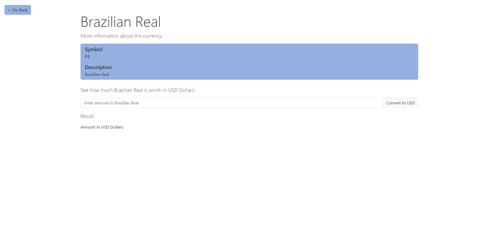

# Cloney Example Repository

<p align="center">
  
</p>

This repository shows an example of how to use [Cloney](https://arthursudbrackibarra.github.io/cloney-documentation/) to create a fictional bank site. Feel free to explore it!

## Clone Example

Here's an example of how to clone this repository using Cloney:

1. Create a `vars.yaml` file with the following content:

    ```yaml
    # File: vars.yaml

    app_name: Cool Bank App

    primary_color: "#ff5d52"

    currencies:
      - name: EUR
        symbol: €
        description: Euro
        usd_rate: 1.06
      - name: GBP
        symbol: £
        description: British Pound
        usd_rate: 1.22
    ```

1. Use `cloney` to clone this repository using the variables defined in `vars.yaml`:

    ```bash
    cloney clone https://github.com/ArthurSudbrackIbarra/cloney-example.git -v vars.yaml
    ```
